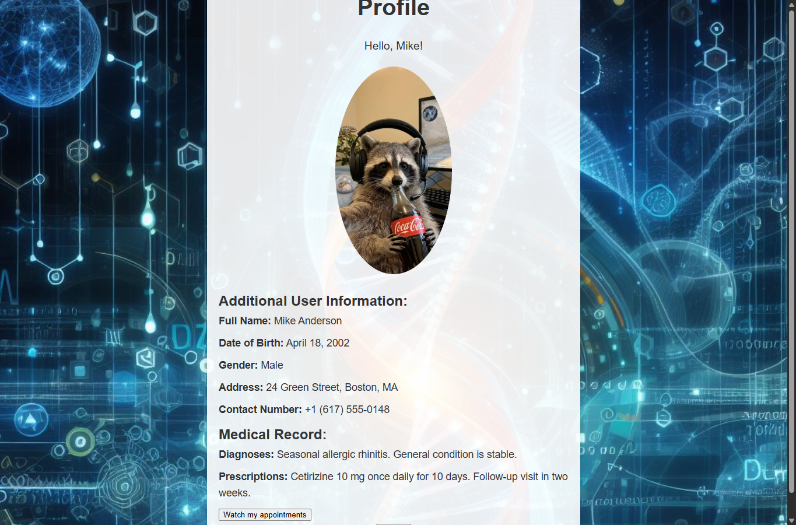
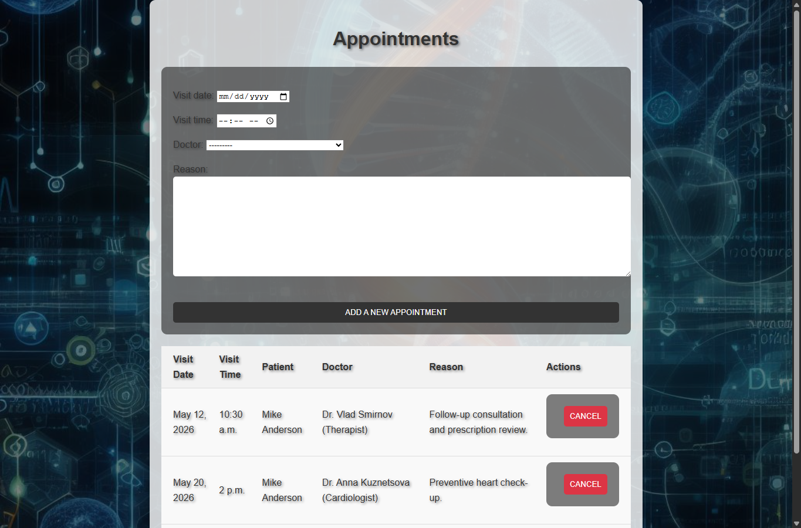
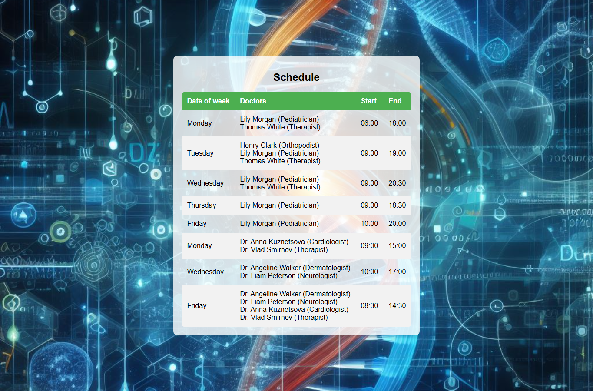
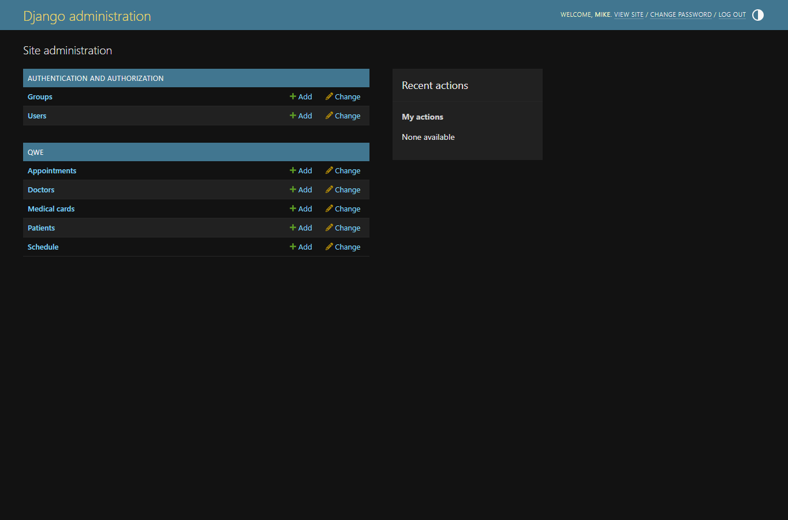

# Medical Clinic Management System

Django clinic-management application for patient profiles, medical records, doctor schedules and appointment booking.

## Preview

### Main Page


### Patient Profile


### Appointments


### Schedule


### Django Admin


## Features

### Patients
- Account registration and authentication
- Personal profile and medical-record view
- Doctor and schedule browsing
- Appointment booking by date and time
- Personal appointment history
- Appointment cancellation

### Administration
- Patient, doctor, appointment, schedule and medical-record management
- Django Admin integration
- Filtering and management of clinic data

## Tech Stack

- Python
- Django
- SQLite
- Django ORM
- Django Templates
- HTML / CSS
- Django Admin

## Project Structure

```text
django-medical-clinic/
├── hospital/
│   ├── hospital/          # Django project configuration
│   ├── mainapp/           # Models, forms, views, templates and static assets
│   ├── db.sqlite3         # Prepared local demo database
│   └── manage.py
├── screenshots/
├── requirements.txt
└── README.md
```

## Run Locally

```bash
git clone https://github.com/MiroCoder/django-medical-clinic.git
cd django-medical-clinic
python -m venv .venv
```

Windows PowerShell:

```powershell
.\.venv\Scripts\Activate.ps1
python -m pip install -r requirements.txt
cd hospital
python manage.py migrate
python manage.py runserver
```

Open:

```text
http://127.0.0.1:8000/mainapp/
```

### Optional environment variables

```text
DJANGO_SECRET_KEY
DJANGO_DEBUG
DJANGO_ALLOWED_HOSTS
DJANGO_TIME_ZONE
```

Local development works with safe development defaults; production secrets should be supplied through environment variables.

## Demo User

The repository keeps a prepared SQLite demo database so the UI can be reviewed immediately.

```text
Username: Mike
Password: MikeDemo123!
```

## Admin

```text
http://127.0.0.1:8000/admin/
```

You can also create a separate administrator:

```bash
python manage.py createsuperuser
```

## Next Improvements

- Stronger appointment validation based on doctor availability
- Automated tests for booking and profile flows
- PostgreSQL configuration for deployment
- Email reminders for upcoming appointments

## Author

[Miroslav Nekhaev / MiroCoder](https://github.com/MiroCoder)
